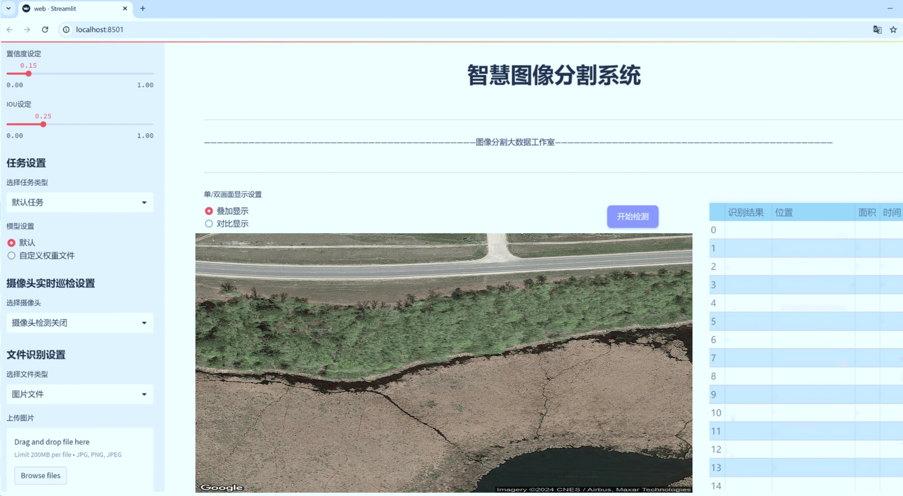
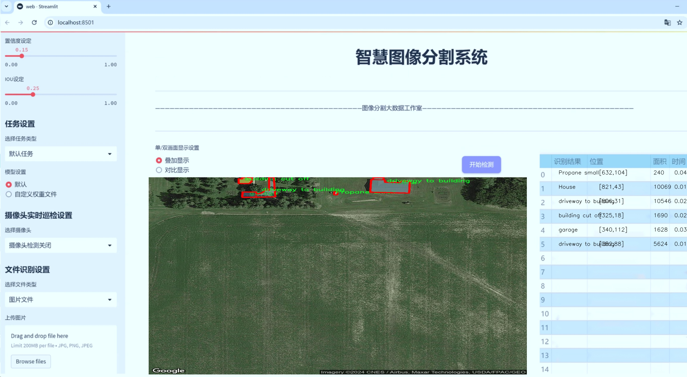
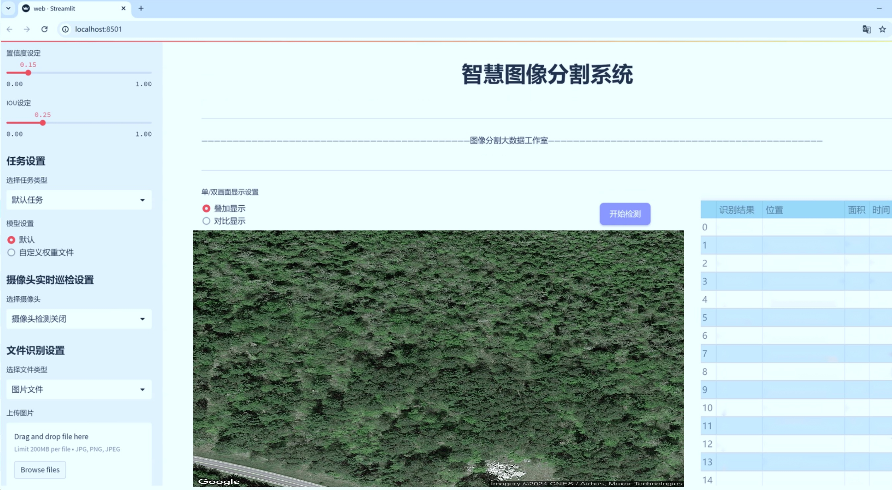
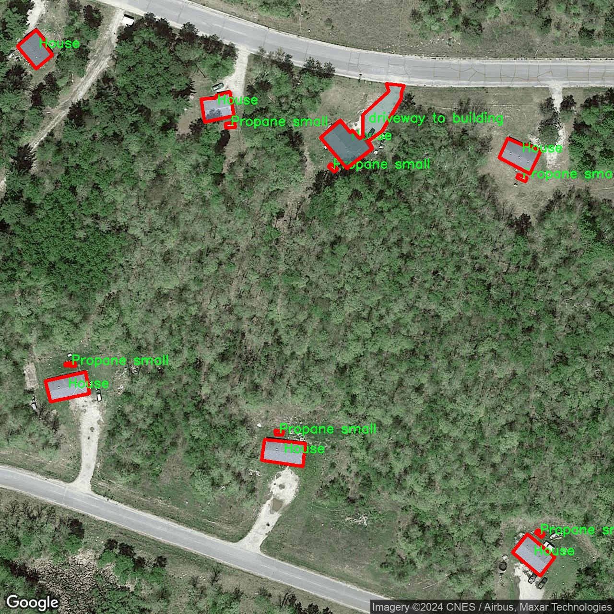
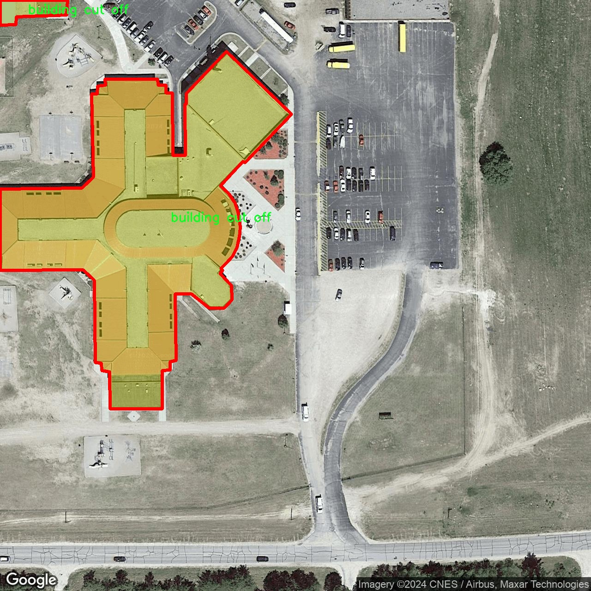
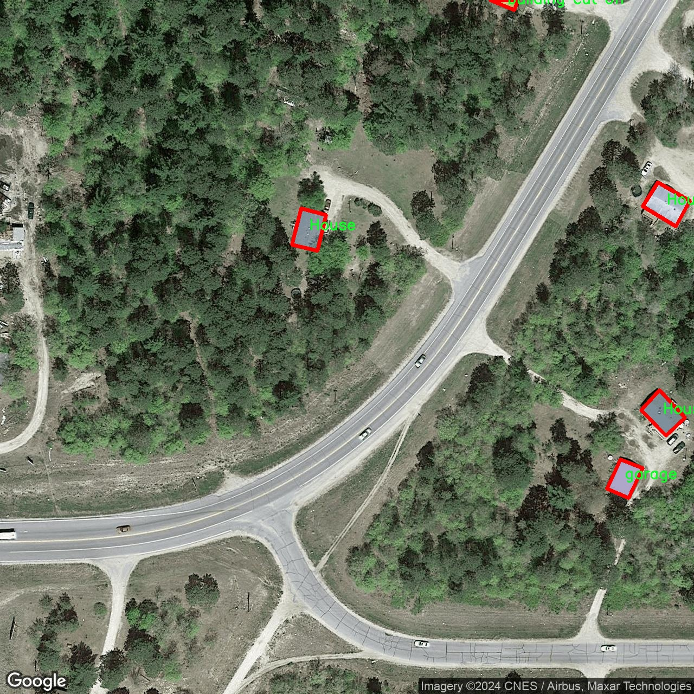
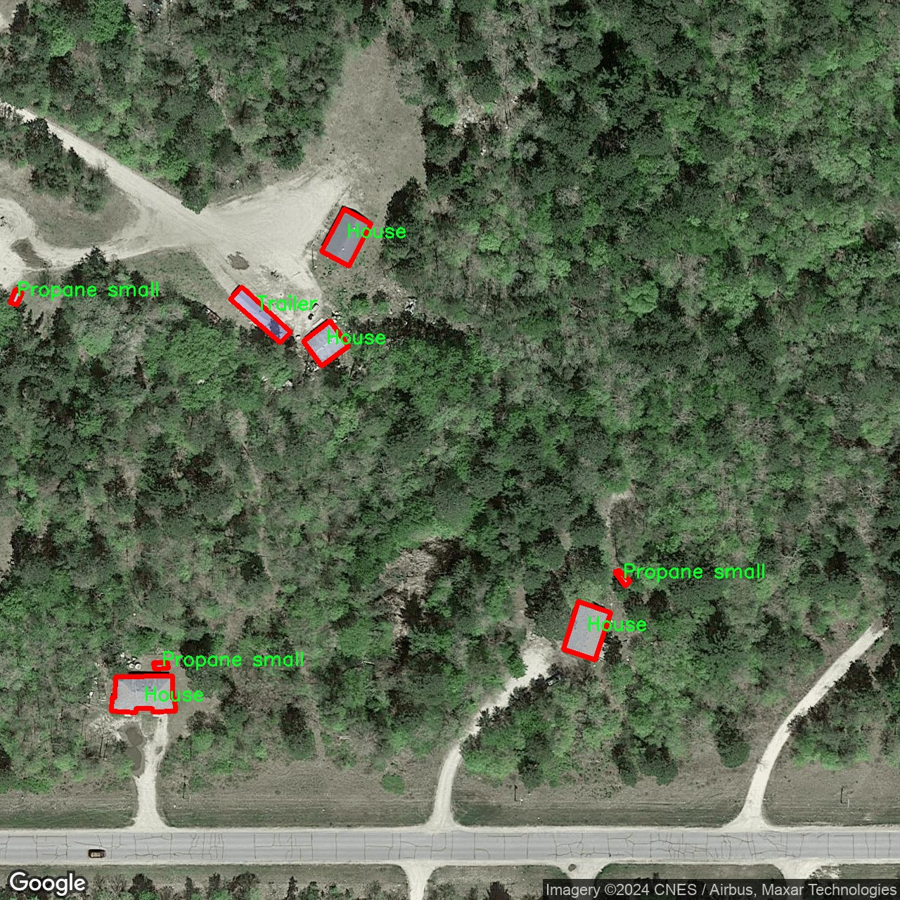
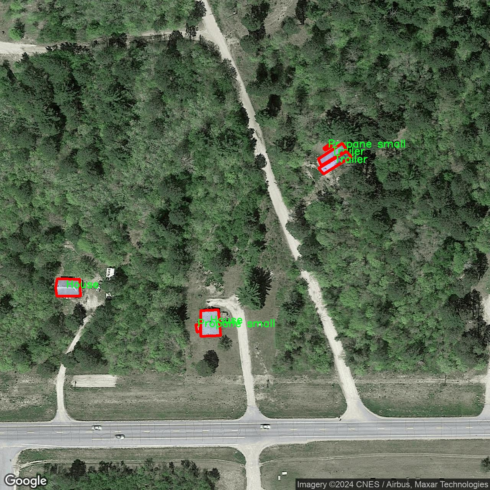

# 航拍建筑物及燃气设施图像分割系统： yolov8-seg-RCSOSA

### 1.研究背景与意义

[参考博客](https://gitee.com/YOLOv8_YOLOv11_Segmentation_Studio/projects)

[博客来源](https://kdocs.cn/l/cszuIiCKVNis)

研究背景与意义

随着城市化进程的加快，建筑物及燃气设施的管理与监控变得愈发重要。尤其是在城市环境中，建筑物的多样性和复杂性使得传统的人工监测手段难以满足实时性和准确性的要求。近年来，航拍技术的迅猛发展为城市建筑物及燃气设施的监测提供了新的视角和手段。通过无人机搭载高分辨率摄像头进行航拍，不仅能够获取广阔区域的图像数据，还能在短时间内覆盖大量目标，为后续的数据分析和处理提供了丰富的基础。

在此背景下，图像分割技术作为计算机视觉领域的重要研究方向，逐渐成为解决建筑物及燃气设施监测问题的关键工具。尤其是基于深度学习的实例分割方法，能够有效地从复杂的背景中提取出不同类别的目标，进而实现对建筑物和燃气设施的精确识别与分类。YOLO（You Only Look Once）系列模型因其高效性和实时性，已成为目标检测领域的佼佼者。最新的YOLOv8模型在性能上有了显著提升，具备了更强的特征提取能力和更快的推理速度，适合在动态变化的城市环境中进行建筑物及燃气设施的实时监测。

本研究旨在基于改进的YOLOv8模型，构建一个高效的航拍建筑物及燃气设施图像分割系统。通过对1000幅航拍图像进行分析，这些图像涵盖了11个类别，包括小型和大型储罐、商业建筑、住宅、拖车等多种建筑类型。这些类别的多样性不仅反映了城市建筑的复杂性，也为模型的训练和验证提供了丰富的样本。研究中所使用的数据集，涵盖了从大型商业建筑到小型住宅的多种建筑形式，能够有效地提升模型在不同场景下的适应性和鲁棒性。

此外，燃气设施的安全性是城市管理中的一项重要任务。通过对燃气设施的精确识别与监测，可以及时发现潜在的安全隐患，降低事故发生的风险。因此，构建一个能够自动识别和分割燃气设施的系统，不仅有助于提升城市管理的智能化水平，也为保障公共安全提供了技术支持。

本研究的意义在于，通过改进YOLOv8模型，推动航拍图像分割技术在建筑物及燃气设施监测中的应用。研究成果将为城市管理者提供更为精准的决策依据，提升城市基础设施的管理效率。同时，研究也将为后续相关领域的研究提供新的思路和方法，推动计算机视觉技术在城市管理中的广泛应用。通过这一系统的实现，我们期待能够为城市的可持续发展贡献一份力量，促进智能城市的建设。

### 2.图片演示







注意：本项目提供完整的训练源码数据集和训练教程,由于此博客编辑较早,暂不提供权重文件（best.pt）,需要按照6.训练教程进行训练后实现上图效果。

### 3.视频演示

[3.1 视频演示](https://www.bilibili.com/video/BV15QB4YqECE/)

### 4.数据集信息

##### 4.1 数据集类别数＆类别名

nc: 11
names: ['-tanksmall-or-tanklarge-', 'Commercial building', 'House', 'Propane Large', 'Propane XL', 'Propane small', 'Trailer', 'building cut off', 'driveway to building', 'garage', 'residential building']


##### 4.2 数据集信息简介

数据集信息展示

在本研究中，我们使用了名为“Data conversion”的数据集，以支持改进YOLOv8-seg的航拍建筑物及燃气设施图像分割系统的训练。该数据集包含11个类别，涵盖了多种建筑物和燃气设施的类型，旨在提高模型在复杂环境中的识别和分割能力。通过精确的图像分割，我们希望能够实现对建筑物及其周边燃气设施的高效识别，从而为城市规划、公共安全及环境监测等领域提供更为可靠的数据支持。

数据集中包含的类别包括：小型油罐或大型油罐、商业建筑、住宅、以及多种类型的丙烷罐（包括大型丙烷罐、超大型丙烷罐和小型丙烷罐）、拖车、被截断的建筑物、通往建筑物的车道、车库和住宅建筑。这些类别的选择反映了在城市环境中常见的建筑物和燃气设施的多样性，为模型的训练提供了丰富的样本和背景信息。

在数据集的构建过程中，我们特别注重图像的多样性和代表性，以确保模型能够在不同的环境和条件下进行有效的分割。例如，商业建筑和住宅的外观、形状和材料各不相同，且在不同的光照和天气条件下，图像的表现也会有所不同。通过包含这些多样化的样本，我们希望提高模型的泛化能力，使其能够适应各种实际应用场景。

此外，数据集中还包括了被截断的建筑物和通往建筑物的车道等类别，这些类别在实际应用中具有重要意义。被截断的建筑物通常出现在航拍图像的边缘区域，模型需要能够准确识别这些部分，以避免在分割过程中出现信息丢失。而通往建筑物的车道则是连接建筑物与周边环境的重要元素，准确识别这些区域对于理解建筑物的布局和周边设施的分布至关重要。

为了进一步提升模型的性能，我们在数据集的标注过程中采用了高精度的标注工具，确保每个类别的边界清晰可辨。标注团队由经验丰富的专业人员组成，他们对建筑物和燃气设施的特征有着深入的理解，这为数据集的质量提供了有力保障。

总之，“Data conversion”数据集不仅为改进YOLOv8-seg的航拍建筑物及燃气设施图像分割系统提供了丰富的训练样本，也为后续的模型评估和应用奠定了坚实的基础。通过对多样化类别的精确标注和丰富样本的整合，我们期待能够实现更高效、更准确的图像分割结果，为相关领域的研究和实践提供有力支持。











### 5.项目依赖环境部署教程（零基础手把手教学）

[5.1 环境部署教程链接（零基础手把手教学）](https://www.bilibili.com/video/BV1jG4Ve4E9t/?vd_source=bc9aec86d164b67a7004b996143742dc)


[5.2 安装Python虚拟环境创建和依赖库安装视频教程链接（零基础手把手教学）](https://www.bilibili.com/video/BV1nA4VeYEze/?vd_source=bc9aec86d164b67a7004b996143742dc)

### 6.手把手YOLOV8-seg训练视频教程（零基础手把手教学）

[6.1 手把手YOLOV8-seg训练视频教程（零基础小白有手就能学会）](https://www.bilibili.com/video/BV1cA4VeYETe/?vd_source=bc9aec86d164b67a7004b996143742dc)


按照上面的训练视频教程链接加载项目提供的数据集，运行train.py即可开始训练



     Epoch   gpu_mem       box       obj       cls    labels  img_size
     1/200     0G   0.01576   0.01955  0.007536        22      1280: 100%|██████████| 849/849 [14:42<00:00,  1.04s/it]
               Class     Images     Labels          P          R     mAP@.5 mAP@.5:.95: 100%|██████████| 213/213 [01:14<00:00,  2.87it/s]
                 all       3395      17314      0.994      0.957      0.0957      0.0843

     Epoch   gpu_mem       box       obj       cls    labels  img_size
     2/200     0G   0.01578   0.01923  0.007006        22      1280: 100%|██████████| 849/849 [14:44<00:00,  1.04s/it]
               Class     Images     Labels          P          R     mAP@.5 mAP@.5:.95: 100%|██████████| 213/213 [01:12<00:00,  2.95it/s]
                 all       3395      17314      0.996      0.956      0.0957      0.0845

     Epoch   gpu_mem       box       obj       cls    labels  img_size
     3/200     0G   0.01561    0.0191  0.006895        27      1280: 100%|██████████| 849/849 [10:56<00:00,  1.29it/s]
               Class     Images     Labels          P          R     mAP@.5 mAP@.5:.95: 100%|███████   | 187/213 [00:52<00:00,  4.04it/s]
                 all       3395      17314      0.996      0.957      0.0957      0.0845


### 7.50+种全套YOLOV8-seg创新点加载调参实验视频教程（一键加载写好的改进模型的配置文件）

[7.1 50+种全套YOLOV8-seg创新点加载调参实验视频教程（一键加载写好的改进模型的配置文件）](https://www.bilibili.com/video/BV1Hw4VePEXv/?vd_source=bc9aec86d164b67a7004b996143742dc)

### YOLOV8-seg算法简介

原始YOLOv8-seg算法原理

YOLOv8-seg算法是YOLO系列目标检测模型的最新版本，承载着前几代模型的精髓，并在此基础上进行了诸多创新与改进，尤其是在目标分割方面的应用。YOLOv8-seg不仅仅是一个目标检测模型，更是一个集成了目标分割功能的高效深度学习框架。其核心原理在于通过精细的特征提取和高效的目标定位，来实现对图像中目标的准确识别与分割。

首先，YOLOv8-seg的网络结构分为三个主要部分：Backbone、Neck和Head。Backbone部分采用了CSPDarknet结构，这是一种交叉阶段部分网络，旨在通过分支的方式提高特征提取的效率和效果。CSPDarknet通过将输入特征图分为两个分支，每个分支经过卷积层进行处理，从而有效地增强了网络的梯度流信息。这种设计使得模型在处理复杂图像时，能够更好地捕捉到细节特征，尤其是在目标边缘和纹理方面的表现显著提升。

在特征提取的过程中，YOLOv8-seg引入了C2f模块，替代了YOLOv5中的C3模块。C2f模块的设计理念在于通过增加特征分支的数量，来丰富网络的特征表达能力。每个C2f模块不仅可以提取到多层次的特征信息，还能通过融合操作将这些信息整合，从而形成更高维度的特征图。这种结构的创新，使得YOLOv8-seg在面对多样化的目标时，能够提供更为准确的分割结果。

接下来，Neck部分采用了特征金字塔网络（FPN）与路径聚合网络（PAN）的结合，旨在充分融合多尺度特征信息。FPN结构通过不同层次的特征图进行上下文信息的整合，而PAN则进一步优化了特征的传递与聚合。这样的设计使得YOLOv8-seg在处理不同尺度的目标时，能够有效地保持信息的完整性与准确性，进而提升分割的精度。

在Head部分，YOLOv8-seg采用了解耦头结构，分为两个并行的分支，分别负责目标的分类和定位。这种解耦设计的优势在于，可以更灵活地处理分类与定位任务，使得模型在进行目标检测时，能够更专注于每个任务的细节。通过1×1卷积层的应用，YOLOv8-seg能够将提取到的特征信息有效地转化为最终的检测结果。

此外，YOLOv8-seg在标签分配策略上也进行了创新，采用了TOOD策略，这是一种动态标签分配方法。与传统的静态标签分配不同，TOOD策略能够根据目标的实际情况动态调整标签的分配，从而提高模型对正负样本的匹配精度。这一策略的引入，使得YOLOv8-seg在处理复杂场景时，能够更好地适应不同目标的特征，进而提升分割效果。

在损失函数的设计上，YOLOv8-seg采用了Varifocal Loss和CIoU Loss的组合。Varifocal Loss通过不对称参数对正负样本进行加权，使得模型在训练过程中能够更加关注高质量的正样本，从而提升整体的检测精度。而CIoU Loss则通过综合考虑目标的中心点、宽高比和面积等因素，进一步优化了目标定位的准确性。这种损失函数的设计，使得YOLOv8-seg在训练过程中能够有效地平衡分类与定位的任务，进而实现更为优异的性能。

综上所述，YOLOv8-seg算法通过创新的网络结构、动态的标签分配策略以及优化的损失函数，构建了一个高效的目标检测与分割框架。其在特征提取、信息融合和任务解耦等方面的改进，使得YOLOv8-seg在目标分割任务中表现出色，能够满足现代计算机视觉应用的需求。随着YOLOv8-seg的不断发展与完善，预计其将在更多领域中发挥重要作用，推动目标检测与分割技术的进一步进步。


### 9.系统功能展示（检测对象为举例，实际内容以本项目数据集为准）

图9.1.系统支持检测结果表格显示

  图9.2.系统支持置信度和IOU阈值手动调节

  图9.3.系统支持自定义加载权重文件best.pt(需要你通过步骤5中训练获得)

  图9.4.系统支持摄像头实时识别

  图9.5.系统支持图片识别

  图9.6.系统支持视频识别

  图9.7.系统支持识别结果文件自动保存

  图9.8.系统支持Excel导出检测结果数据


### 10.50+种全套YOLOV8-seg创新点原理讲解（非科班也可以轻松写刊发刊，V11版本正在科研待更新）

#### 10.1 由于篇幅限制，每个创新点的具体原理讲解就不一一展开，具体见下列网址中的创新点对应子项目的技术原理博客网址【Blog】：


[10.1 50+种全套YOLOV8-seg创新点原理讲解链接](https://gitee.com/qunmasj/good)

#### 10.2 部分改进模块原理讲解(完整的改进原理见上图和技术博客链接)【如果此小节的图加载失败可以通过CSDN或者Github搜索该博客的标题访问原始博客，原始博客图片显示正常】
### YOLOv8简介
YOLO（You Only Look Once）是一种流行的对象检测和图像分割模型，由华盛顿大学的Joseph Redmon和Ali Farhadi开发。YOLO于2015年推出，以其高速度和高精度迅速走红。

YOLOv2于2016年发布，通过合并批处理规范化、锚盒和维度集群来改进原始模型
2018年推出的YOLOv3使用更高效的骨干网络、多个锚点和空间金字塔池进一步增强了该模型的性能
YOLOv4于2020年发布，引入了Mosaic数据增强、新的无锚检测头和新的丢失功能等创新
YOLOv5进一步提高了模型的性能，并添加了超参数优化、集成实验跟踪和自动导出到流行导出格式等新功能
YOLOv6于2022年由美团开源，目前正在该公司的许多自动配送机器人中使用
YOLOv7在COCO关键点数据集上添加了额外的任务，如姿态估计
YOLOv8是Ultralytics公司推出的YOLO的最新版本。作为一款尖端、最先进的（SOTA）车型，YOLOv8在之前版本的成功基础上，引入了新的功能和改进，以增强性能、灵活性和效率。YOLOv8支持全方位的视觉AI任务，包括检测、分割、姿态估计、跟踪和分类。这种多功能性允许用户在不同的应用程序和域中利用YOLOv8的功能
#### YOLOv8的新特性与可用模型

Ultralytics 并没有直接将开源库命名为 YOLOv8，而是直接使用 ultralytics 这个词，原因是 ultralytics 将这个库定位为算法框架，而非某一个特定算法，一个主要特点是可扩展性。其希望这个库不仅仅能够用于 YOLO 系列模型，而是能够支持非 YOLO 模型以及分类分割姿态估计等各类任务。总而言之，ultralytics 开源库的两个主要优点是：

融合众多当前 SOTA 技术于一体
未来将支持其他 YOLO 系列以及 YOLO 之外的更多算法
Ultralytics为YOLO模型发布了一个全新的存储库。它被构建为 用于训练对象检测、实例分割和图像分类模型的统一框架。

提供了一个全新的 SOTA 模型，包括 P5 640 和 P6 1280 分辨率的目标检测网络和基于 YOLACT 的实例分割模型。和 YOLOv5 一样，基于缩放系数也提供了 N/S/M/L/X 尺度的不同大小模型，用于满足不同场景需求
骨干网络和 Neck 部分可能参考了 YOLOv7 ELAN 设计思想，将 YOLOv5 的 C3 结构换成了梯度流更丰富的 C2f 结构，并对不同尺度模型调整了不同的通道数，属于对模型结构精心微调，不再是无脑一套参数应用所有模型，大幅提升了模型性能。不过这个 C2f 模块中存在 Split 等操作对特定硬件部署没有之前那么友好了
Head 部分相比 YOLOv5 改动较大，换成了目前主流的解耦头结构，将分类和检测头分离，同时也从 Anchor-Based 换成了 Anchor-Free
Loss 计算方面采用了 TaskAlignedAssigner 正样本分配策略，并引入了 Distribution Focal Loss
训练的数据增强部分引入了 YOLOX 中的最后 10 epoch 关闭 Mosiac 增强的操作，可以有效地提升精度
YOLOv8 还高效灵活地支持多种导出格式，并且该模型可以在 CPU 和 GPU 上运行。YOLOv8 模型的每个类别中有五个模型用于检测、分割和分类。YOLOv8 Nano 是最快和最小的，而 YOLOv8 Extra Large (YOLOv8x) 是其中最准确但最慢的。


### FocalModulation模型的基本原理
参考该博客，Focal Modulation Networks（FocalNets）的基本原理是替换自注意力（Self-Attention）模块，使用焦点调制（focal modulation）机制来捕捉图像中的长距离依赖和上下文信息。下图是自注意力和焦点调制两种方法的对比。


自注意力要求对每个查询令牌（Query Token）与其他令牌进行复杂的查询-键（Query-Key）交互和查询-值（Query-Value）聚合，以计算注意力分数并捕捉上下文。而焦点调制则先将空间上下文以不同粒度聚合到调制器中，然后以查询依赖的方式将这些调制器注入到查询令牌中。焦点调制简化了交互和聚合操作，使其更轻量级。在图中，自注意力部分使用红色虚线表示查询-键交互和黄色虚线表示查询-值聚合，而焦点调制部分则用蓝色表示调制器聚合和黄色表示查询-调制器交互。 

FocalModulation模型通过以下步骤实现：

1. 焦点上下文化：用深度卷积层堆叠来编码不同范围的视觉上下文。


2. 门控聚合：通过门控机制，选择性地将上下文信息聚合到每个查询令牌的调制器中。


3. 逐元素仿射变换：将聚合后的调制器通过仿射变换注入到每个查询令牌中。

下面来分别介绍这三个机制->

#### 焦点上下文化
焦点上下文化（Focal Contextualization）是焦点调制（Focal Modulation）的一个组成部分。焦点上下文化使用一系列深度卷积层（depth-wise convolutional layers）来编码不同范围内的视觉上下文信息。这些层可以捕捉从近处到远处的视觉特征，从而允许网络在不同层次上理解图像内容。通过这种方式，网络能够在聚合上下文信息时保持对局部细节的敏感性，并增强对全局结构的认识。


​

这张图详细比较了自注意力（Self-Attention, SA）和焦点调制（Focal Modulation）的机制，并特别展示了焦点调制中的上下文聚合过程。左侧的图展示了自注意力模型如何通过键（k）和查询（q）之间的交互，以及随后的聚合来生成输出。而中间和右侧的图说明了焦点调制如何通过层级化的上下文聚合和门控聚合过程替代自注意力模型的这一过程。在焦点调制中，输入首先通过轻量级线性层进行处理，然后通过层级化的上下文化模块和门控机制来选择性地聚合信息，最终通过调制器与查询（q）进行交互以生成输出。

#### 门控聚合
在Focal Modulation Networks（FocalNets）中的 "门控聚合"（Gated Aggregation）是关键组件之一，这一过程涉及使用门控机制来选择性地聚合上下文信息。以下是这个过程的详细分析：

1. 什么是门控机制？
门控机制在深度学习中常用于控制信息流。它通常用于决定哪些信息应该被传递，哪些应该被阻断。在循环神经网络（RNN）中，特别是在长短期记忆网络（LSTM）和门控循环单元（GRU）中，门控机制用于调节信息在时间序列数据中的流动。

2. 门控聚合的目的
在FocalNets中，门控聚合的目的是为每个查询令牌（即处理中的数据单元）选择性地聚合上下文信息。这意味着网络能够决定哪些特定的上下文信息对于当前处理的查询令牌是重要的，从而专注于那些最相关的信息。

3. 如何实现门控聚合？
实现门控聚合可能涉及一系列计算步骤，其中包括：

计算上下文信息：这可能涉及使用深度卷积层（如文中提到的）对输入图像的不同区域进行编码，以捕捉从局部到全局的视觉上下文。
门控操作：这一步骤涉及到一个决策过程，根据当前查询令牌的特征来决定哪些上下文信息是相关的。这可能通过一个学习到的权重（门）来实现，该权重决定了不同上下文信息的重要性。
信息聚合：最后，根据门控操作的结果，选择性地聚合上下文信息到一个调制器中。这个调制器随后被用于调整或“调制”查询令牌的表示。
4. 门控聚合的好处
通过门控聚合，FocalNets能够更有效地聚焦于对当前任务最关键的信息。这种方法提高了模型的效率和性能，因为它减少了不必要信息的处理，同时增强了对关键特征的关注。在视觉任务中，这可能意味着更好的目标检测和图像分类性能，特别是在复杂或多变的视觉环境中。

总结：门控聚合是FocalNets的一个核心组成部分，它通过选择性地集中处理重要的上下文信息来提升网络的效率和性能。

#### 逐元素仿射变换
在Focal Modulation Networks（FocalNets）中的第三个关键组件是逐元素仿射变换，这个步骤涉及将通过门控聚合得到的调制器注入到每个查询令牌中。以下是该过程的详细分析：

1. 仿射变换的基本概念：
仿射变换是一种线性变换，用于对数据进行缩放、旋转、平移和倾斜等操作。在深度学习中，逐元素的仿射变换通常指的是对每个元素进行线性变换，这种变换可以被描述为y = ax + b，其中x是输入，y是输出，a和b是变换的参数。

2. 逐元素仿射变换的作用：
在FocalNets中，逐元素仿射变换的作用是将聚合后的调制器信息注入到每个查询令牌中。这个步骤对于整合上下文信息和查询令牌的原始特征非常重要。通过这种方式，调制器所包含的上下文信息可以直接影响查询令牌的表示。

3. 执行仿射变换：
执行这一步骤时，聚合后的调制器对每个查询令牌进行逐元素的仿射变换。在实践中，这可能意味着对查询令牌的每个特征应用调制器中的相应权重（a）和偏差（b）。这样，调制器中的每个元素都直接对应于查询令牌的一个特征，通过调整这些特征来改变其表达。

4. 仿射变换的效果：
通过逐元素仿射变换，模型能够更细致地调整每个查询令牌的特征，根据上下文信息来增强或抑制某些特征。这种精细的调整机制允许网络更好地适应复杂的视觉场景，提高对细节的捕捉能力，从而提升了模型在各种视觉任务中的性能，如目标检测和图像分类。

总结：逐元素仿射变换它使得模型能够利用上下文信息来有效地调整查询令牌，增强了模型对关键视觉特征的捕捉和表达能力。


### 11.项目核心源码讲解（再也不用担心看不懂代码逻辑）

#### 11.1 ultralytics\nn\backbone\revcol.py

以下是经过精简和注释的核心代码部分：

```python
import torch
import torch.nn as nn

# 定义反向传播函数
class ReverseFunction(torch.autograd.Function):
    @staticmethod
    def forward(ctx, run_functions, alpha, *args):
        # 保存传入的函数和缩放因子
        ctx.run_functions = run_functions
        ctx.alpha = alpha
        
        # 获取输入参数
        x, c0, c1, c2, c3 = args
        
        # 通过函数计算并应用缩放因子
        c0 = run_functions[0](x, c1) + c0 * alpha[0]
        c1 = run_functions[1](c0, c2) + c1 * alpha[1]
        c2 = run_functions[2](c1, c3) + c2 * alpha[2]
        c3 = run_functions[3](c2, None) + c3 * alpha[3]
        
        # 保存中间结果以便反向传播使用
        ctx.save_for_backward(x, c0, c1, c2, c3)
        return x, c0, c1, c2, c3

    @staticmethod
    def backward(ctx, *grad_outputs):
        # 获取保存的中间结果
        x, c0, c1, c2, c3 = ctx.saved_tensors
        run_functions = ctx.run_functions
        alpha = ctx.alpha
        
        # 计算梯度
        g3_up = grad_outputs[4]
        g3_left = g3_up * alpha[3]
        # 反向传播
        # 省略了具体的反向传播细节
        # ...

        return None, None, gx_up, g0_left, g1_left, g2_left, g3_left

# 定义子网络
class SubNet(nn.Module):
    def __init__(self, channels, layers, kernel, first_col, save_memory) -> None:
        super().__init__()
        # 初始化缩放因子
        self.alpha = [nn.Parameter(torch.ones((1, channels[i], 1, 1)), requires_grad=True) for i in range(len(channels))]
        
        # 创建各层
        self.levels = nn.ModuleList([Level(i, channels, layers, kernel, first_col) for i in range(len(channels))])

    def forward(self, *args):
        # 计算前向传播
        c = args
        for i in range(len(self.levels)):
            c[i] = (self.alpha[i]) * c[i] + self.levels[i](c[i-1] if i > 0 else args[0], c[i+1] if i < len(c)-1 else None)
        return c

# 定义主网络
class RevCol(nn.Module):
    def __init__(self, kernel='C2f', channels=[32, 64, 96, 128], layers=[2, 3, 6, 3], num_subnet=5, save_memory=True) -> None:
        super().__init__()
        self.num_subnet = num_subnet
        self.channels = channels
        
        # 初始化输入层
        self.stem = Conv(3, channels[0], k=4, s=4, p=0)

        # 创建多个子网络
        for i in range(num_subnet):
            first_col = (i == 0)
            self.add_module(f'subnet{i}', SubNet(channels, layers, kernel, first_col, save_memory))

    def forward(self, x):
        # 前向传播
        c = [0] * 4  # 初始化四个通道
        x = self.stem(x)        
        for i in range(self.num_subnet):
            c = getattr(self, f'subnet{i}')(x, *c)       
        return c
```

### 代码说明
1. **ReverseFunction**: 这是一个自定义的反向传播函数，使用 PyTorch 的 `torch.autograd.Function`。它的 `forward` 方法计算前向传播的结果，并保存中间变量以供反向传播使用。`backward` 方法则计算梯度。

2. **SubNet**: 这是一个子网络类，包含多个层。它初始化时会创建缩放因子和各层，并在 `forward` 方法中依次计算每一层的输出。

3. **RevCol**: 这是主网络类，包含多个子网络和一个输入层。它在 `forward` 方法中处理输入并将其传递给每个子网络，最终返回多个通道的输出。

### 注意事项
- 省略了反向传播的具体实现细节，主要关注核心逻辑。
- 代码中的 `Conv` 和 `Level` 类未包含具体实现，假设它们在其他地方定义。

这个文件 `revcol.py` 是一个实现深度学习模型反向传播和特征融合的模块，主要使用 PyTorch 框架。代码中定义了多个类和函数，用于构建一个名为 RevCol 的神经网络架构。该架构的设计理念是通过特征的反向传播和融合来提高模型的性能。

首先，文件中导入了必要的库，包括 PyTorch 的核心库和一些自定义模块（如 Conv、C2f、C3、C3Ghost）。接着，定义了一些辅助函数，这些函数主要用于处理 GPU 状态、设备管理和张量的分离与梯度计算。

`get_gpu_states` 函数用于获取当前 GPU 的随机数生成状态，而 `get_gpu_device` 函数则用于从输入的张量中提取出使用的 GPU 设备。`set_device_states` 函数则用于设置 CPU 和 GPU 的随机数生成状态。`detach_and_grad` 函数用于分离输入张量并设置其需要计算梯度的标志。

接下来是 `ReverseFunction` 类，它是一个自定义的 PyTorch 自动求导函数。这个类的 `forward` 方法实现了反向传播过程中的前向计算逻辑，包括多个层的计算和特征融合。`backward` 方法则实现了反向传播过程，计算梯度并进行特征的反向更新。这个类的设计允许在反向传播过程中有效地管理 GPU 状态和张量的梯度。

`Fusion` 类用于实现特征的融合操作，根据输入的层级和通道数进行下采样和上采样。`Level` 类则代表网络中的一个层级，包含了融合操作和多个卷积块。`SubNet` 类是一个子网络的实现，包含多个层级和相应的参数，用于处理输入特征并进行融合。

最后，`RevCol` 类是整个模型的顶层实现，它初始化了多个子网络，并定义了前向传播逻辑。在前向传播中，输入通过 stem 层进行处理，然后依次通过每个子网络进行特征提取和融合，最终返回多个层级的特征输出。

整体来看，这个文件实现了一个复杂的神经网络结构，结合了反向传播和特征融合的策略，以提高模型在特定任务上的表现。通过使用自定义的反向传播函数和灵活的网络结构，RevCol 模型能够有效地处理多层次的特征信息。

#### 11.2 ultralytics\models\yolo\segment\val.py

以下是经过简化和注释的核心代码部分，主要关注于 `SegmentationValidator` 类的关键功能和方法。

```python
# 导入必要的库
from multiprocessing.pool import ThreadPool
from pathlib import Path
import numpy as np
import torch
import torch.nn.functional as F
from ultralytics.utils import ops

class SegmentationValidator:
    """
    用于基于分割模型的验证的类，继承自 DetectionValidator。
    """

    def __init__(self, dataloader=None, save_dir=None, args=None):
        """初始化 SegmentationValidator，设置任务为 'segment'，并初始化指标。"""
        self.dataloader = dataloader  # 数据加载器
        self.save_dir = save_dir  # 保存目录
        self.args = args  # 参数
        self.metrics = SegmentMetrics(save_dir=self.save_dir)  # 初始化指标
        self.plot_masks = []  # 用于存储绘图的掩码
        self.process = None  # 掩码处理函数

    def preprocess(self, batch):
        """预处理批次，将掩码转换为浮点数并发送到设备。"""
        batch['masks'] = batch['masks'].to(self.device).float()  # 将掩码转换为浮点数并移动到设备
        return batch

    def init_metrics(self, model):
        """初始化指标并选择掩码处理函数。"""
        if self.args.save_json:
            self.process = ops.process_mask_upsample  # 更精确的掩码处理
        else:
            self.process = ops.process_mask  # 更快的掩码处理

    def postprocess(self, preds):
        """后处理 YOLO 预测，返回输出检测结果和原型。"""
        p = ops.non_max_suppression(preds[0], self.args.conf, self.args.iou)  # 应用非极大值抑制
        proto = preds[1][-1] if len(preds[1]) == 3 else preds[1]  # 获取原型
        return p, proto

    def update_metrics(self, preds, batch):
        """更新指标，计算正确的掩码和边界框。"""
        for si, (pred, proto) in enumerate(zip(preds[0], preds[1])):
            idx = batch['batch_idx'] == si  # 当前批次索引
            cls = batch['cls'][idx]  # 当前批次的类别
            bbox = batch['bboxes'][idx]  # 当前批次的边界框
            npr = pred.shape[0]  # 预测数量
            shape = batch['ori_shape'][si]  # 原始图像形状

            if npr == 0:  # 如果没有预测
                continue

            # 处理掩码
            gt_masks = batch['masks'][idx]  # 获取真实掩码
            pred_masks = self.process(proto, pred[:, 6:], pred[:, :4], shape=batch['img'][si].shape[1:])  # 处理预测掩码

            # 评估
            if cls.shape[0]:  # 如果有真实标签
                correct_masks = self._process_batch(pred, cls, pred_masks, gt_masks)  # 处理掩码
                # 更新统计信息
                self.stats.append((correct_masks, pred[:, 4], pred[:, 5], cls.squeeze(-1)))

    def _process_batch(self, detections, labels, pred_masks, gt_masks):
        """
        返回正确的预测矩阵。
        """
        iou = mask_iou(gt_masks.view(gt_masks.shape[0], -1), pred_masks.view(pred_masks.shape[0], -1))  # 计算掩码的 IoU
        return self.match_predictions(detections[:, 5], labels[:, 0], iou)  # 匹配预测

    def plot_predictions(self, batch, preds, ni):
        """绘制批次预测的掩码和边界框。"""
        plot_images(batch['img'], preds, paths=batch['im_file'], fname=self.save_dir / f'val_batch{ni}_pred.jpg')

    def pred_to_json(self, predn, filename, pred_masks):
        """将预测结果保存为 JSON 格式。"""
        # 处理预测掩码并保存
        # ...（具体实现省略）
```

### 代码说明：
1. **初始化**：`__init__` 方法初始化了数据加载器、保存目录和参数，并设置了指标和掩码处理函数。
2. **预处理**：`preprocess` 方法将输入批次中的掩码转换为浮点数并移动到指定设备。
3. **后处理**：`postprocess` 方法应用非极大值抑制以过滤预测结果，并返回处理后的预测和原型。
4. **更新指标**：`update_metrics` 方法计算预测的掩码和边界框的正确性，并更新统计信息。
5. **处理批次**：`_process_batch` 方法计算掩码的 IoU，并返回正确的预测矩阵。
6. **绘图**：`plot_predictions` 方法用于绘制预测结果，包括掩码和边界框。
7. **保存结果**：`pred_to_json` 方法将预测结果保存为 JSON 格式，以便后续评估。

以上是代码的核心部分和详细注释，提供了对分割模型验证的基本理解。

这个程序文件是一个用于YOLO（You Only Look Once）模型的分割验证器，名为`SegmentationValidator`，它继承自`DetectionValidator`类。该类的主要功能是对分割模型的输出进行验证和评估，主要用于计算分割任务的性能指标。

首先，文件导入了一些必要的库，包括多线程处理、路径操作、NumPy、PyTorch等，以及YOLO模型相关的检测验证器和工具函数。`SegmentationValidator`类的构造函数初始化了一些属性，包括数据加载器、保存目录、进度条、参数和回调函数。它还设置了任务类型为“分割”，并初始化了用于保存评估指标的`SegmentMetrics`对象。

在`preprocess`方法中，输入的批次数据会被预处理，将掩码（mask）转换为浮点数并发送到指定的设备（如GPU）。`init_metrics`方法用于初始化评估指标，并根据是否需要保存JSON格式的结果选择掩码处理函数。

`get_desc`方法返回一个格式化的字符串，描述评估指标的名称。`postprocess`方法对YOLO模型的预测结果进行后处理，应用非极大值抑制（NMS）来过滤重复的检测框，并返回处理后的预测结果和原型数据。

在`update_metrics`方法中，程序会根据模型的预测结果和真实标签更新评估指标。它首先检查当前批次的预测数量，如果没有预测结果，则跳过该批次。接着，它会处理掩码数据，计算正确的掩码和边界框，并将结果添加到统计信息中。

`finalize_metrics`方法用于设置评估指标的速度和混淆矩阵。`_process_batch`方法用于计算正确预测的矩阵，支持对掩码和边界框的处理。`plot_val_samples`和`plot_predictions`方法用于可视化验证样本和模型的预测结果。

`pred_to_json`方法将预测结果保存为JSON格式，包含图像ID、类别ID、边界框和分割掩码。`eval_json`方法用于评估COCO格式的目标检测指标，利用pycocotools库计算mAP（平均精度均值）等指标。

整体来看，这个文件实现了YOLO分割模型的验证和评估流程，涵盖了数据预处理、指标计算、结果可视化和保存等多个方面，为用户提供了一个完整的分割模型验证工具。

#### 11.3 ultralytics\models\yolo\classify\__init__.py

```python
# 导入Ultralytics YOLO库中的分类模型相关模块
# Ultralytics YOLO 🚀, AGPL-3.0 license

# 导入分类预测器，用于进行图像分类的预测
from ultralytics.models.yolo.classify.predict import ClassificationPredictor

# 导入分类训练器，用于训练分类模型
from ultralytics.models.yolo.classify.train import ClassificationTrainer

# 导入分类验证器，用于验证分类模型的性能
from ultralytics.models.yolo.classify.val import ClassificationValidator

# 定义模块的公开接口，指定可以被外部访问的类
__all__ = 'ClassificationPredictor', 'ClassificationTrainer', 'ClassificationValidator'
```

### 代码核心部分说明：
1. **导入模块**：
   - `ClassificationPredictor`：用于进行图像分类的预测，能够根据输入的图像返回分类结果。
   - `ClassificationTrainer`：用于训练分类模型，负责模型的训练过程，包括数据加载、模型优化等。
   - `ClassificationValidator`：用于验证训练好的模型，评估模型在验证集上的表现，计算准确率等指标。

2. **`__all__`**：
   - 该变量定义了模块的公开接口，只有在使用 `from module import *` 时，才会导入 `ClassificationPredictor`、`ClassificationTrainer` 和 `ClassificationValidator` 这三个类。这有助于控制模块的可见性，避免不必要的名称冲突。

这个程序文件是Ultralytics YOLO项目中的一个初始化文件，位于`ultralytics/models/yolo/classify`目录下。文件的主要功能是导入与分类相关的模块，并定义了一个公共接口。

首先，文件开头有一行注释，表明这是Ultralytics YOLO项目的一部分，并且该项目遵循AGPL-3.0许可证。这意味着该代码是开源的，用户可以自由使用和修改，但需要遵循相应的许可证条款。

接下来，文件通过`from`语句导入了三个类：`ClassificationPredictor`、`ClassificationTrainer`和`ClassificationValidator`。这些类分别负责分类任务中的不同功能。具体来说，`ClassificationPredictor`用于进行分类预测，`ClassificationTrainer`用于训练分类模型，而`ClassificationValidator`则用于验证分类模型的性能。

最后，`__all__`变量被定义为一个包含字符串的元组，列出了在使用`from module import *`语句时可以导出的公共接口。这意味着如果其他模块或脚本想要使用这个模块中的功能，只需导入这三个类即可。

总体来说，这个文件的作用是将分类相关的功能模块组织在一起，方便其他部分的代码进行调用和使用。

#### 11.4 ultralytics\nn\backbone\SwinTransformer.py

以下是简化后的代码，保留了核心部分，并添加了详细的中文注释：

```python
import torch
import torch.nn as nn
import torch.nn.functional as F
import numpy as np

class Mlp(nn.Module):
    """ 多层感知机（MLP）模块。 """

    def __init__(self, in_features, hidden_features=None, out_features=None, act_layer=nn.GELU, drop=0.):
        super().__init__()
        out_features = out_features or in_features  # 输出特征数默认为输入特征数
        hidden_features = hidden_features or in_features  # 隐藏层特征数默认为输入特征数
        self.fc1 = nn.Linear(in_features, hidden_features)  # 第一层线性变换
        self.act = act_layer()  # 激活函数
        self.fc2 = nn.Linear(hidden_features, out_features)  # 第二层线性变换
        self.drop = nn.Dropout(drop)  # Dropout层

    def forward(self, x):
        """ 前向传播函数。 """
        x = self.fc1(x)  # 线性变换
        x = self.act(x)  # 激活
        x = self.drop(x)  # Dropout
        x = self.fc2(x)  # 线性变换
        x = self.drop(x)  # Dropout
        return x


class WindowAttention(nn.Module):
    """ 窗口基础的多头自注意力模块。 """

    def __init__(self, dim, window_size, num_heads, qkv_bias=True, attn_drop=0., proj_drop=0.):
        super().__init__()
        self.dim = dim  # 输入通道数
        self.window_size = window_size  # 窗口大小
        self.num_heads = num_heads  # 注意力头数
        head_dim = dim // num_heads  # 每个头的维度
        self.scale = head_dim ** -0.5  # 缩放因子

        # 相对位置偏置参数表
        self.relative_position_bias_table = nn.Parameter(
            torch.zeros((2 * window_size[0] - 1) * (2 * window_size[1] - 1), num_heads))

        # 计算相对位置索引
        coords_h = torch.arange(self.window_size[0])
        coords_w = torch.arange(self.window_size[1])
        coords = torch.stack(torch.meshgrid([coords_h, coords_w]))  # 生成坐标网格
        coords_flatten = torch.flatten(coords, 1)  # 展平坐标
        relative_coords = coords_flatten[:, :, None] - coords_flatten[:, None, :]  # 计算相对坐标
        relative_coords = relative_coords.permute(1, 2, 0).contiguous()  # 调整维度
        relative_coords[:, :, 0] += self.window_size[0] - 1  # 归一化坐标
        relative_coords[:, :, 1] += self.window_size[1] - 1
        relative_coords[:, :, 0] *= 2 * self.window_size[1] - 1
        self.relative_position_index = relative_coords.sum(-1)  # 计算相对位置索引

        self.qkv = nn.Linear(dim, dim * 3, bias=qkv_bias)  # QKV线性变换
        self.attn_drop = nn.Dropout(attn_drop)  # 注意力Dropout
        self.proj = nn.Linear(dim, dim)  # 输出线性变换
        self.proj_drop = nn.Dropout(proj_drop)  # 输出Dropout
        self.softmax = nn.Softmax(dim=-1)  # Softmax层

    def forward(self, x, mask=None):
        """ 前向传播函数。 """
        B_, N, C = x.shape  # 获取输入形状
        qkv = self.qkv(x).reshape(B_, N, 3, self.num_heads, C // self.num_heads).permute(2, 0, 3, 1, 4)  # 计算QKV
        q, k, v = qkv[0], qkv[1], qkv[2]  # 分离Q、K、V

        q = q * self.scale  # 缩放Q
        attn = (q @ k.transpose(-2, -1))  # 计算注意力分数

        # 添加相对位置偏置
        relative_position_bias = self.relative_position_bias_table[self.relative_position_index.view(-1)].view(
            self.window_size[0] * self.window_size[1], self.window_size[0] * self.window_size[1], -1)
        relative_position_bias = relative_position_bias.permute(2, 0, 1).contiguous()  # 调整维度
        attn = attn + relative_position_bias.unsqueeze(0)  # 加入相对位置偏置

        attn = self.softmax(attn)  # Softmax归一化
        attn = self.attn_drop(attn)  # 注意力Dropout

        x = (attn @ v).transpose(1, 2).reshape(B_, N, C)  # 计算输出
        x = self.proj(x)  # 输出线性变换
        x = self.proj_drop(x)  # 输出Dropout
        return x


class SwinTransformer(nn.Module):
    """ Swin Transformer主干网络。 """

    def __init__(self, patch_size=4, in_chans=3, embed_dim=96, depths=[2, 2, 6, 2], num_heads=[3, 6, 12, 24]):
        super().__init__()
        self.patch_embed = PatchEmbed(patch_size=patch_size, in_chans=in_chans, embed_dim=embed_dim)  # 图像分块嵌入

        # 构建每一层
        self.layers = nn.ModuleList()
        for i_layer in range(len(depths)):
            layer = BasicLayer(
                dim=int(embed_dim * 2 ** i_layer),
                depth=depths[i_layer],
                num_heads=num_heads[i_layer],
                window_size=7,
                mlp_ratio=4.
            )
            self.layers.append(layer)

    def forward(self, x):
        """ 前向传播函数。 """
        x = self.patch_embed(x)  # 进行图像分块嵌入
        for layer in self.layers:
            x = layer(x)  # 逐层前向传播
        return x


def SwinTransformer_Tiny(weights=''):
    """ 创建Swin Transformer Tiny模型。 """
    model = SwinTransformer(depths=[2, 2, 6, 2], num_heads=[3, 6, 12, 24])  # 初始化模型
    if weights:
        model.load_state_dict(torch.load(weights)['model'])  # 加载权重
    return model
```

### 代码说明
1. **Mlp类**：实现了一个多层感知机，包含两层线性变换和激活函数，支持Dropout。
2. **WindowAttention类**：实现了窗口基础的多头自注意力机制，计算Q、K、V，并应用相对位置偏置。
3. **SwinTransformer类**：构建了Swin Transformer主干网络，包含图像分块嵌入和多个基本层。
4. **SwinTransformer_Tiny函数**：用于创建一个小型的Swin Transformer模型，并可选择加载预训练权重。

此代码保留了Swin Transformer的核心功能，适合进行图像处理任务。

这个程序文件实现了Swin Transformer模型的结构，Swin Transformer是一种基于视觉的Transformer架构，主要用于图像处理任务。代码中定义了多个类和函数，以构建Swin Transformer的各个组件。

首先，文件导入了必要的库，包括PyTorch和一些自定义的层和函数。`Mlp`类实现了一个多层感知机（MLP），包含两个线性层和一个激活函数（默认为GELU），并在每个线性层后添加了Dropout以防止过拟合。

接下来，`window_partition`和`window_reverse`函数用于将输入特征分割成窗口（patches）以及将窗口重新组合成原始特征图。这种窗口机制是Swin Transformer的核心，允许模型在局部区域内进行自注意力计算。

`WindowAttention`类实现了基于窗口的多头自注意力机制（W-MSA），支持相对位置偏置。它的构造函数定义了输入通道数、窗口大小、注意力头数等参数，并初始化了相关的权重。`forward`方法计算输入特征的注意力权重，并将其应用于值（values）。

`SwinTransformerBlock`类是Swin Transformer的基本构建块，包含了归一化层、窗口注意力层和MLP。它还支持循环移位（shifted window attention），以增强模型的上下文捕捉能力。

`PatchMerging`类用于将特征图的补丁合并，以减少特征图的分辨率，同时增加通道数。这在Swin Transformer的不同阶段中用于下采样。

`BasicLayer`类表示Swin Transformer的一个基本层，包含多个Swin Transformer块和一个可选的下采样层。它计算了SW-MSA的注意力掩码，并在每个块中应用注意力机制。

`PatchEmbed`类负责将输入图像分割成补丁并进行嵌入，使用卷积层将图像转换为特征表示。

`SwinTransformer`类是整个模型的主类，构建了多个基本层，并在前向传播中依次通过这些层。它还支持绝对位置嵌入、Dropout等功能。

最后，`update_weight`函数用于更新模型的权重，从预训练模型中加载权重。`SwinTransformer_Tiny`函数则创建一个Swin Transformer模型实例，并可选择加载预训练权重。

总体而言，这个文件实现了Swin Transformer的完整结构，包含了从输入图像到特征提取的所有必要组件，适用于各种计算机视觉任务。

#### 11.5 ultralytics\models\sam\model.py

以下是代码中最核心的部分，并附上详细的中文注释：

```python
from pathlib import Path  # 导入Path类，用于处理文件路径

from ultralytics.engine.model import Model  # 从Ultralytics库导入Model基类
from ultralytics.utils.torch_utils import model_info  # 导入用于获取模型信息的工具

from .build import build_sam  # 导入构建SAM模型的函数
from .predict import Predictor  # 导入预测器类


class SAM(Model):
    """
    SAM（Segment Anything Model）接口类。

    SAM旨在进行可提示的实时图像分割。可以使用多种提示方式，如边界框、点或标签。
    该模型具有零-shot性能，并在SA-1B数据集上进行训练。
    """

    def __init__(self, model='sam_b.pt') -> None:
        """
        使用预训练模型文件初始化SAM模型。

        参数：
            model (str): 预训练SAM模型文件的路径。文件应具有.pt或.pth扩展名。

        异常：
            NotImplementedError: 如果模型文件扩展名不是.pt或.pth。
        """
        # 检查模型文件的扩展名是否为.pt或.pth
        if model and Path(model).suffix not in ('.pt', '.pth'):
            raise NotImplementedError('SAM预测需要预训练的*.pt或*.pth模型。')
        super().__init__(model=model, task='segment')  # 调用父类构造函数，初始化模型和任务类型

    def predict(self, source, stream=False, bboxes=None, points=None, labels=None, **kwargs):
        """
        对给定的图像或视频源执行分割预测。

        参数：
            source (str): 图像或视频文件的路径，或PIL.Image对象，或numpy.ndarray对象。
            stream (bool, optional): 如果为True，则启用实时流。默认为False。
            bboxes (list, optional): 用于提示分割的边界框坐标列表。默认为None。
            points (list, optional): 用于提示分割的点列表。默认为None。
            labels (list, optional): 用于提示分割的标签列表。默认为None。

        返回：
            (list): 模型的预测结果。
        """
        # 设置默认的超参数
        overrides = dict(conf=0.25, task='segment', mode='predict', imgsz=1024)
        kwargs.update(overrides)  # 更新kwargs以包含超参数
        prompts = dict(bboxes=bboxes, points=points, labels=labels)  # 创建提示字典
        return super().predict(source, stream, prompts=prompts, **kwargs)  # 调用父类的预测方法

    def info(self, detailed=False, verbose=True):
        """
        记录有关SAM模型的信息。

        参数：
            detailed (bool, optional): 如果为True，则显示有关模型的详细信息。默认为False。
            verbose (bool, optional): 如果为True，则在控制台上显示信息。默认为True。

        返回：
            (tuple): 包含模型信息的元组。
        """
        return model_info(self.model, detailed=detailed, verbose=verbose)  # 获取并返回模型信息

    @property
    def task_map(self):
        """
        提供从'segment'任务到其对应'预测器'的映射。

        返回：
            (dict): 将'segment'任务映射到其对应'预测器'的字典。
        """
        return {'segment': {'predictor': Predictor}}  # 返回任务与预测器的映射关系
```

### 代码说明：
1. **导入模块**：导入必要的模块和类，用于处理文件路径、模型和预测。
2. **SAM类**：定义了一个名为`SAM`的类，继承自`Model`，用于实现图像分割功能。
3. **初始化方法**：构造函数中检查模型文件的扩展名，并调用父类的构造函数进行初始化。
4. **预测方法**：`predict`方法用于对输入的图像或视频进行分割预测，支持多种提示方式。
5. **信息方法**：`info`方法用于获取和记录模型的信息。
6. **任务映射**：`task_map`属性提供了任务与预测器之间的映射关系。

这个程序文件是Ultralytics公司开发的SAM（Segment Anything Model）模型的接口实现，主要用于实时图像分割任务。SAM模型具备高度的灵活性，能够通过不同的提示方式（如边界框、点或标签）进行图像分割，并且具有零-shot性能，意味着它可以在没有先前知识的情况下适应新的图像分布和任务。该模型是基于SA-1B数据集进行训练的。

在文件的开头，首先导入了一些必要的模块和类，包括路径处理模块`Path`、基础模型类`Model`、模型信息获取工具`model_info`，以及构建和预测相关的功能模块。接着定义了一个名为`SAM`的类，该类继承自`Model`类，主要用于实现SAM模型的功能。

在`SAM`类的构造函数中，接受一个模型文件的路径作为参数，并检查该文件的扩展名是否为`.pt`或`.pth`，如果不是，则抛出`NotImplementedError`异常。构造函数调用了父类的初始化方法，并指定任务为“分割”。

`_load`方法用于加载指定的权重文件到SAM模型中，接收权重文件的路径和可选的任务名称作为参数。

`predict`方法是模型进行分割预测的核心功能，接受图像或视频源的路径、是否启用实时流、边界框、点和标签等参数，并返回模型的预测结果。该方法会将一些默认参数（如置信度和图像大小）与用户提供的参数合并后传递给父类的`predict`方法。

`__call__`方法是`predict`方法的别名，提供了相同的功能，使得用户可以更方便地调用模型进行预测。

`info`方法用于记录和显示关于SAM模型的信息，可以选择是否显示详细信息和是否在控制台输出。

最后，`task_map`属性提供了一个从“分割”任务到其对应的`Predictor`的映射，返回一个字典，方便在不同任务之间进行切换和调用。

整体来看，这个文件实现了SAM模型的基本功能和接口，方便用户进行图像分割任务的调用和管理。

### 12.系统整体结构（节选）

### 整体功能和构架概括

Ultralytics项目是一个基于深度学习的计算机视觉框架，专注于目标检测、图像分割和分类等任务。该项目采用了模块化的设计，允许用户灵活地构建和训练各种视觉模型。以下是各个文件的功能概述：

1. **`revcol.py`**：实现了RevCol神经网络架构，结合了反向传播和特征融合的策略，旨在提高模型在特定任务上的表现。
2. **`val.py`**：用于YOLO分割模型的验证，计算模型的性能指标，并提供可视化和结果保存功能。
3. **`__init__.py`**：作为YOLO分类模块的初始化文件，导入分类相关的类，提供公共接口。
4. **`SwinTransformer.py`**：实现了Swin Transformer模型的结构，包含多种组件（如窗口注意力、特征嵌入等），用于图像处理任务。
5. **`model.py`**：实现了Segment Anything Model（SAM）的接口，支持多种分割任务的实时预测，具有零-shot能力。

### 文件功能整理表

| 文件路径                                           | 功能描述                                                     |
|---------------------------------------------------|------------------------------------------------------------|
| `ultralytics/nn/backbone/revcol.py`               | 实现RevCol神经网络架构，结合反向传播和特征融合策略。      |
| `ultralytics/models/yolo/segment/val.py`         | YOLO分割模型的验证，计算性能指标，支持可视化和结果保存。   |
| `ultralytics/models/yolo/classify/__init__.py`   | YOLO分类模块的初始化文件，导入分类相关类，提供公共接口。   |
| `ultralytics/nn/backbone/SwinTransformer.py`     | 实现Swin Transformer模型结构，包含窗口注意力和特征嵌入。  |
| `ultralytics/models/sam/model.py`                 | 实现Segment Anything Model（SAM）的接口，支持实时分割预测。 |

这个表格总结了每个文件的主要功能，展示了Ultralytics项目在计算机视觉任务中的模块化设计和灵活性。

### 13.图片、视频、摄像头图像分割Demo(去除WebUI)代码

在这个博客小节中，我们将讨论如何在不使用WebUI的情况下，实现图像分割模型的使用。本项目代码已经优化整合，方便用户将分割功能嵌入自己的项目中。
核心功能包括图片、视频、摄像头图像的分割，ROI区域的轮廓提取、类别分类、周长计算、面积计算、圆度计算以及颜色提取等。
这些功能提供了良好的二次开发基础。

### 核心代码解读

以下是主要代码片段，我们会为每一块代码进行详细的批注解释：

```python
import random
import cv2
import numpy as np
from PIL import ImageFont, ImageDraw, Image
from hashlib import md5
from model import Web_Detector
from chinese_name_list import Label_list

# 根据名称生成颜色
def generate_color_based_on_name(name):
    ......

# 计算多边形面积
def calculate_polygon_area(points):
    return cv2.contourArea(points.astype(np.float32))

...
# 绘制中文标签
def draw_with_chinese(image, text, position, font_size=20, color=(255, 0, 0)):
    image_pil = Image.fromarray(cv2.cvtColor(image, cv2.COLOR_BGR2RGB))
    draw = ImageDraw.Draw(image_pil)
    font = ImageFont.truetype("simsun.ttc", font_size, encoding="unic")
    draw.text(position, text, font=font, fill=color)
    return cv2.cvtColor(np.array(image_pil), cv2.COLOR_RGB2BGR)

# 动态调整参数
def adjust_parameter(image_size, base_size=1000):
    max_size = max(image_size)
    return max_size / base_size

# 绘制检测结果
def draw_detections(image, info, alpha=0.2):
    name, bbox, conf, cls_id, mask = info['class_name'], info['bbox'], info['score'], info['class_id'], info['mask']
    adjust_param = adjust_parameter(image.shape[:2])
    spacing = int(20 * adjust_param)

    if mask is None:
        x1, y1, x2, y2 = bbox
        aim_frame_area = (x2 - x1) * (y2 - y1)
        cv2.rectangle(image, (x1, y1), (x2, y2), color=(0, 0, 255), thickness=int(3 * adjust_param))
        image = draw_with_chinese(image, name, (x1, y1 - int(30 * adjust_param)), font_size=int(35 * adjust_param))
        y_offset = int(50 * adjust_param)  # 类别名称上方绘制，其下方留出空间
    else:
        mask_points = np.concatenate(mask)
        aim_frame_area = calculate_polygon_area(mask_points)
        mask_color = generate_color_based_on_name(name)
        try:
            overlay = image.copy()
            cv2.fillPoly(overlay, [mask_points.astype(np.int32)], mask_color)
            image = cv2.addWeighted(overlay, 0.3, image, 0.7, 0)
            cv2.drawContours(image, [mask_points.astype(np.int32)], -1, (0, 0, 255), thickness=int(8 * adjust_param))

            # 计算面积、周长、圆度
            area = cv2.contourArea(mask_points.astype(np.int32))
            perimeter = cv2.arcLength(mask_points.astype(np.int32), True)
            ......

            # 计算色彩
            mask = np.zeros(image.shape[:2], dtype=np.uint8)
            cv2.drawContours(mask, [mask_points.astype(np.int32)], -1, 255, -1)
            color_points = cv2.findNonZero(mask)
            ......

            # 绘制类别名称
            x, y = np.min(mask_points, axis=0).astype(int)
            image = draw_with_chinese(image, name, (x, y - int(30 * adjust_param)), font_size=int(35 * adjust_param))
            y_offset = int(50 * adjust_param)

            # 绘制面积、周长、圆度和色彩值
            metrics = [("Area", area), ("Perimeter", perimeter), ("Circularity", circularity), ("Color", color_str)]
            for idx, (metric_name, metric_value) in enumerate(metrics):
                ......

    return image, aim_frame_area

# 处理每帧图像
def process_frame(model, image):
    pre_img = model.preprocess(image)
    pred = model.predict(pre_img)
    det = pred[0] if det is not None and len(det)
    if det:
        det_info = model.postprocess(pred)
        for info in det_info:
            image, _ = draw_detections(image, info)
    return image

if __name__ == "__main__":
    cls_name = Label_list
    model = Web_Detector()
    model.load_model("./weights/yolov8s-seg.pt")

    # 摄像头实时处理
    cap = cv2.VideoCapture(0)
    while cap.isOpened():
        ret, frame = cap.read()
        if not ret:
            break
        ......

    # 图片处理
    image_path = './icon/OIP.jpg'
    image = cv2.imread(image_path)
    if image is not None:
        processed_image = process_frame(model, image)
        ......

    # 视频处理
    video_path = ''  # 输入视频的路径
    cap = cv2.VideoCapture(video_path)
    while cap.isOpened():
        ret, frame = cap.read()
        ......
```


### 14.完整训练+Web前端界面+50+种创新点源码、数据集获取


# [下载链接：https://mbd.pub/o/bread/Z5iamJpy](https://mbd.pub/o/bread/Z5iamJpy)